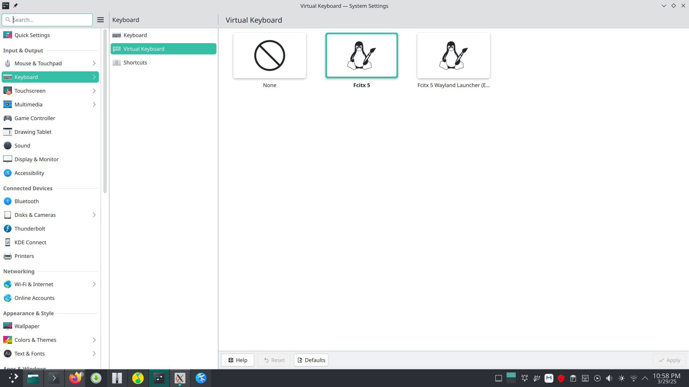
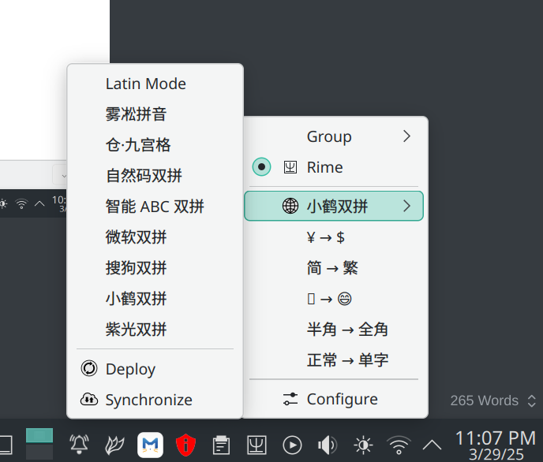
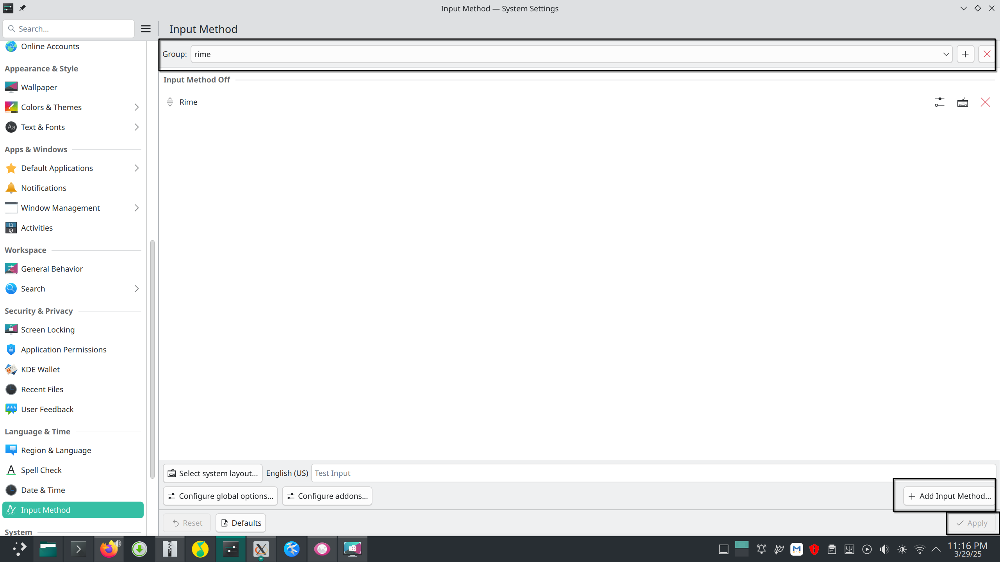
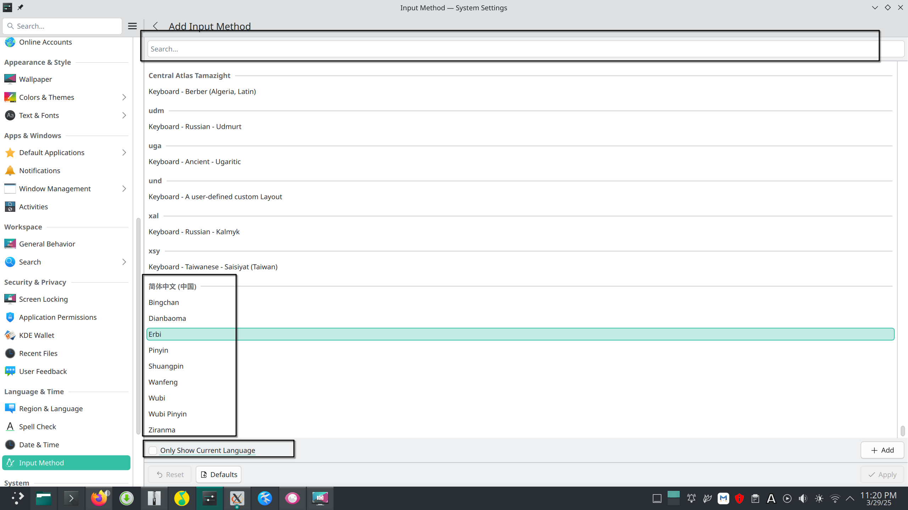
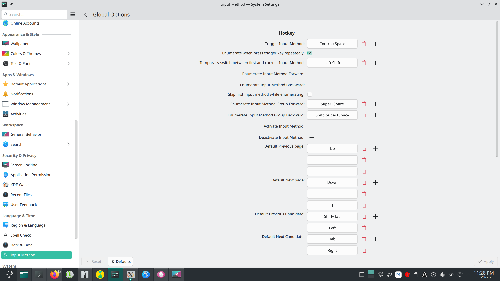
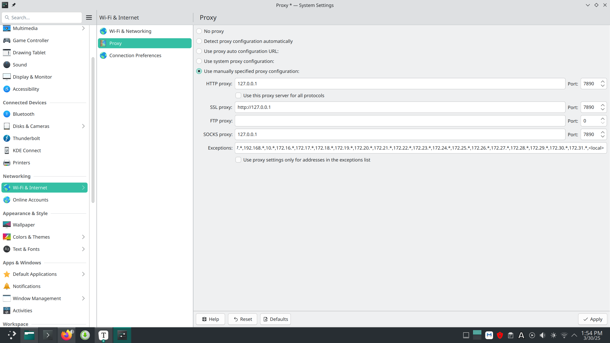
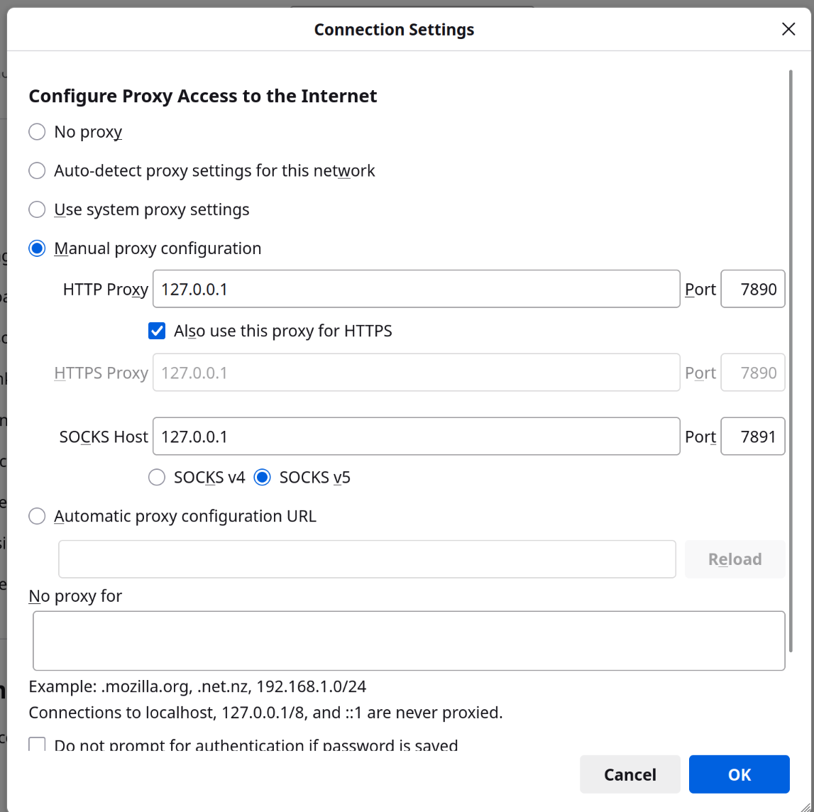

# your manjaro configuration

[toc]

## 中文输入法😊

我们使用Fcitx5(小企鹅)来解决输入法：

1. 首先，删除fcitx4相关的包：

   ~~~shell
   sudo pacman -Rs $(pacman -Qsq fcitx)
   ~~~

2. 然后，安装fcitx5及其相应的插件：

   ~~~shell
   sudo pacman -S fcitx5 fcitx5-configtool fcitx5-qt fcitx5-gtk fcitx5-chinese-addons
   fcitx5-material-color fcitx-rime
   ~~~

3. 添加环境变量以及默认启动

   - 修改输入法环境变量，使应用可以调用Fcitx5输入法
   - 将下面的内容粘贴到`~/.pam_environment`

   ```
   GTK_IM_MODULE DEFAULT=fcitx
   QT_IM_MODULE DEFAULT=fcitx
   XMODIFIERS  DEFAULT=@im=fcitx
   ```

   - 将下面的内容粘贴到 `~/.xprofile`(每次使用gdm等图形登录时读取并运用里面的设定)

   ```
   fcitx5 &
   ```

4. 配置主题

   - 使用`fcitx5-material-color`这个主题,可以参照: https://github.com/hosxy/Fcitx5-Material-Color

   修改 `~/.config/fcitx5/conf/classicui.conf`

   ```
   # 垂直候选列表
   Vertical Candidate List=False`
   
   # 按屏幕 DPI 使用
   PerScreenDPI=True
   
   # Font (设置成你喜欢的字体)
   Font="思源黑体 CN Medium 13"
   
   #主题
   Theme=Material-Color-DeepPurple
   ```

   

5. 之后,打开System setting--->Virtual KeyBoard:点选Fcitx5。

   

6. 最后，reboot,然后会发现下方状态栏右侧有个键盘图标，鼠标右键可以看到一些东西。

   

7. system setting --->input method:点击小加号，创建输入法组；然后，点击add input method,

   

   ​	

8. 然后你最好把那个`only show current langu`取消勾选,找到你的理想输入法（search一下找rime)

   

   然后Config global configuration
   
   

## VPN⚡

​	由于现在clash for windows以及clash verge rev越来越不好用了，所以我选择mihomo party:

~~~shell
sudo yay -Syu mihomo-party
~~~

安装好mihomo-party后，我们需要将订阅的机场上传(上传不了，自行下载到本地，要把文件名改为有`.yaml`形式的样子），然后打开系统代理或tun模式。然后打开System settings-->wifi and internet-->proxy:



> **note**:tun模式是一个很强大的模式，他基本不需要你再为其他应用如终端、git、npm、docker等设置代理，但是tun模式在国内登录chatgpt时会提示region 问题，所以我们只开启system proxy，不启动tun模式即可。
>
> 如果只开启system proxy，firefox需要配置一下：在地址栏输入`about:perferences`,然后划拉到最底，打开Network Setting.配置如下图：
>
> 

## 一些问题😭

### windows 和 manjaro的双系统有时候会导致从windows切换到manjaro后，manjaro会搜索不到wifi。

~~~markdown
**Dual-boot with Windows (双系统启动)**：

- 这里提到的 **dual-boot** 指的是你可能同时在同一台机器上安装了 Manjaro 和 Windows 操作系统。
- 可能是由于 Windows 系统没有正确关闭，导致它锁定了无线网卡资源，这在双系统设置中时有发生。

**Fast Startup (快速启动)**：

- **Fast Startup** 是 Windows 中的一项功能，旨在加速系统启动。它并不完全关闭系统，而是保存当前的系统状态和内存内容，以便下次启动时能够更快恢复。
- 这个功能可能会导致硬件设备（如无线网卡）在 Windows 系统启动后未完全释放资源，从而影响在 Linux（如 Manjaro）下的使用。

**Reinstall Windows (重新安装 Windows)**：

- 该段提到某个 Arch 论坛的解决方案包括重新安装 Windows。虽然这听起来极端，但其实只是为了彻底禁用 **fast startup**，确保 Windows 不再锁定硬件资源。

**Proper Shutdown (正确关机)**：

- 如果你不想重新安装 Windows，可以通过命令行来确保 Windows 系统正确关机，从而避免 **fast startup** 干扰硬件。使用以下命令(cmd里运行）来关闭快速启动：

  ```
  shutdown /s /f /t 0
  ```

- 或者直接在 Windows 中禁用快速启动，可以通过以下步骤：

  1. 打开 **控制面板**。
  2. 选择 **电源选项**，然后点击 **选择电源按钮的功能**。
  3. 点击 **更改当前不可用的设置**。
  4. 在下方的 **关机设置** 中，取消勾选 **启用快速启动（推荐）**。
  5. 保存更改并关闭窗口。


~~~


